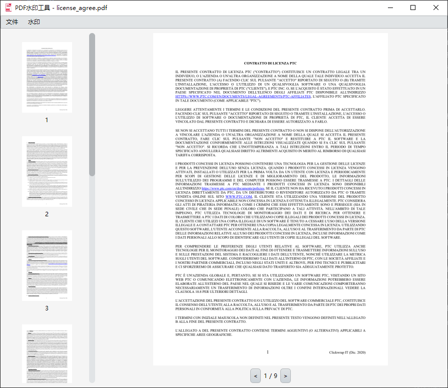
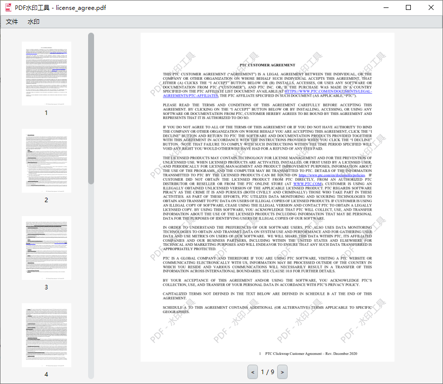
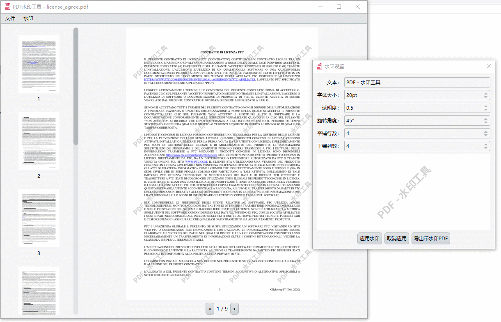

<h4 align="right">
  <strong>English</strong> | <a href="README.md">中文</a>
</h4>

# PdfTool - PDF Watermark Processing Tool




## 📝 Project Overview

PdfTool is a PDF watermark processing tool based on Qt5 and PDFium, providing an intuitive graphical interface that supports PDF file browsing, watermark addition, and saving functionality. The tool features a modern interface design, supports Chinese localization, and integrates font subsetting technology to optimize file sizes.

## ✨ Key Features

### 📖 PDF Browsing
- **Multi-page browsing**: Complete browsing support for multi-page PDF files
- **Thumbnail navigation**: Left thumbnail panel for quick page jumping
- **Zoom adaptation**: Automatic screen DPI adaptation, supporting high DPI displays
- **Page navigation**: Previous/next page button navigation

### 💧 Watermark Features
- **Text watermark**: Support for custom text content watermark addition
- **Font settings**: Built-in Noto Sans CJK SC font, supporting Chinese display
- **Style customization**:
  - Adjustable font size
  - Transparency settings (0-1)
  - Rotation angle adjustment
- **Layout control**:
  - Repeat row count setting
  - Repeat column count setting
  - Automatic spacing calculation
- **Real-time preview**: Preview effects before adding watermarks

### 💾 File Operations
- **Open PDF**: Support for standard PDF file formats
- **Save file**: Directly save modifications to the original file
- **Save as**: Save modified files to a new location
- **Font subsetting**: Automatically optimize embedded fonts, reduce file size

## 🏗️ Technical Architecture

### Core Technology Stack
- **Qt 5**: Cross-platform GUI framework
- **PDFium**: Google open-source PDF rendering engine
- **Sfntly**: Google font processing library for font subsetting
- **CMake**: Cross-platform build system

### Project Structure

PdfTool/
├── CMakeLists.txt          # CMake build configuration
├── main.cpp                # Application entry point
├── PdfTool.cpp/h           # Main window implementation
├── PdfTool.ui              # Qt Designer interface file
├── WatermarkSetting.cpp/h  # Watermark settings dialog
├── Thumbnail.cpp/h         # Thumbnail component
├── DpiManager.cpp/h        # DPI management
├── fonts/                  # Font files
│   └── NotoSansCJKsc-Bold.ttf
├── pdfium/                 # PDFium library files
├── ttfsubset/              # Font subsetting code
└── qss/                    # Qt stylesheets


## 🚀 Quick Start

### Environment Requirements
- **Operating System**: Windows 10/11 (x64)
- **Compiler**: Visual Studio 2019 or higher
- **Qt Version**: Qt 5.9.7 or higher
- **CMake**: 3.10 or higher

### Build Steps

1. **Clone the project**
```bash
git clone https://github.com/ZypherChan/PdfTool.git
cd PdfTool
```

2. **Set up Qt environment**
Make sure to set the `QTDIR` environment variable to point to your Qt installation directory:
```bash
set QTDIR=C:\Qt\5.15.2\msvc2019_64
```

3. **Create build directory**
```bash
mkdir build
cd build
```

4. **Generate project files**
```bash
cmake .. -DCMAKE_BUILD_TYPE=Release
```

5. **Build the project**
```bash
cmake --build . 
```

### Deployment Instructions

The project uses `windeployqt` to automatically deploy Qt dependencies. After compilation is complete, it will automatically:
- Copy Qt core libraries (Qt5Core.dll, Qt5Gui.dll, Qt5Widgets.dll)
- Deploy platform plugins (platforms directory)
- Copy font files to output directory
- Exclude unnecessary components (translations, icon engines, image format plugins, etc.)

## 📸 Interface Preview

### Main Interface


### Watermark Settings Dialog


### Watermark Effect Preview


### Real-time Preview


## ⚙️ Configuration Options

### Runtime Configuration

The program will automatically load the following configurations:
- **Stylesheet**: `:/qss/silvery.css` - Silver theme interface
- **Chinese font**: `fonts/NotoSansCJKsc-Bold.ttf` - Support for Chinese watermarks
- **Translation file**: `:/PdfTool_zh_CN.qm` - Chinese interface localization

## 🎯 Features To Be Implemented

- [ ] **Watermark color**: Select watermark color (default gray)
- [ ] **Watermark position**: Precise control of watermark position (top-left, center, bottom-right, etc.)
- [ ] **Image watermark**: Support for adding images as watermarks
- [ ] **Font settings**: Support for user selection of watermark fonts

---
💡 **Welcome to contribute**: If you have features you want to implement, feel free to submit Issues or Pull Requests!
💬 **Feature suggestions**: Have good feature ideas? Please share your suggestions in Issues!

## 🐛 FAQ

### Q: The program cannot open PDF files?
**A**: Make sure pdfium.dll is in the same directory as the executable file, and it's the x64 version.

### Q: Chinese characters in watermarks appear as boxes?
**A**: Check if the `fonts/NotoSansCJKsc-Bold.ttf` file exists, and the font file is complete.

## 🤝 Contributing Guidelines

Welcome to submit Issues and Pull Requests!

### Submission Guidelines
- Use clear commit messages
- Add appropriate test cases
- Update relevant documentation

### Development Environment Setup
1. Fork the project to your repository
2. Create a feature branch (`git checkout -b feature/amazing-feature`)
3. Commit changes (`git commit -m 'Add some amazing feature'`)
4. Push to branch (`git push origin feature/amazing-feature`)
5. Create Pull Request

## 📄 License

This project uses the MIT License - see the [LICENSE](LICENSE) file for details.

## 🙏 Acknowledgments

- [PDFium](https://pdfium.googlesource.com/pdfium/) - Google open-source PDF engine
- [Qt Framework](https://www.qt.io/) - Cross-platform application development framework
- [Sfntly](https://github.com/googlefonts/sfntly) - Google font processing library
- [Noto Fonts](https://fonts.google.com/noto) - Google open-source font project

⭐ If this project is helpful to you, please give it a Star for support!